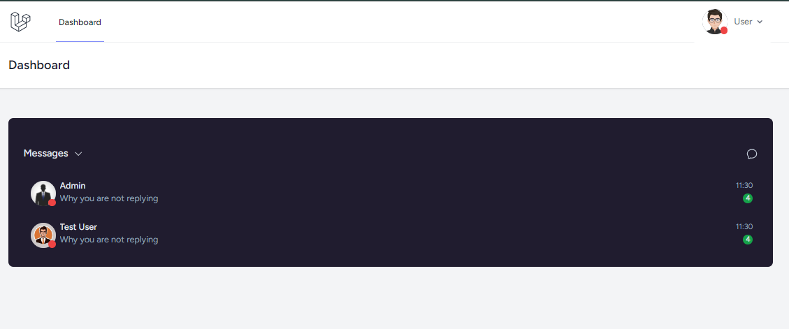
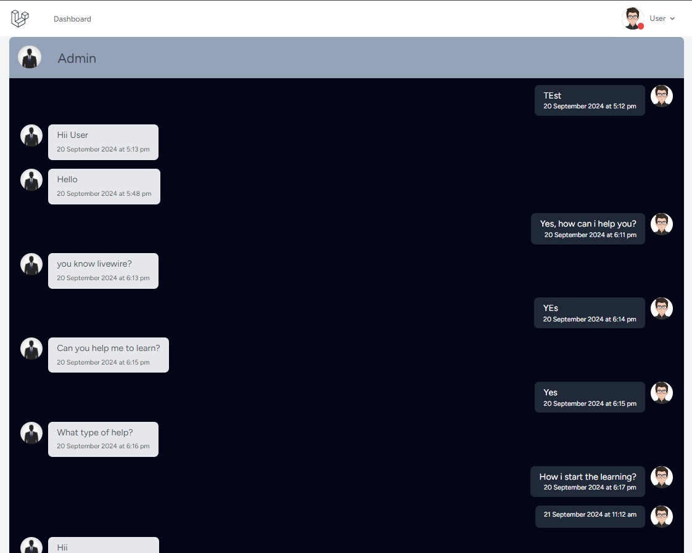
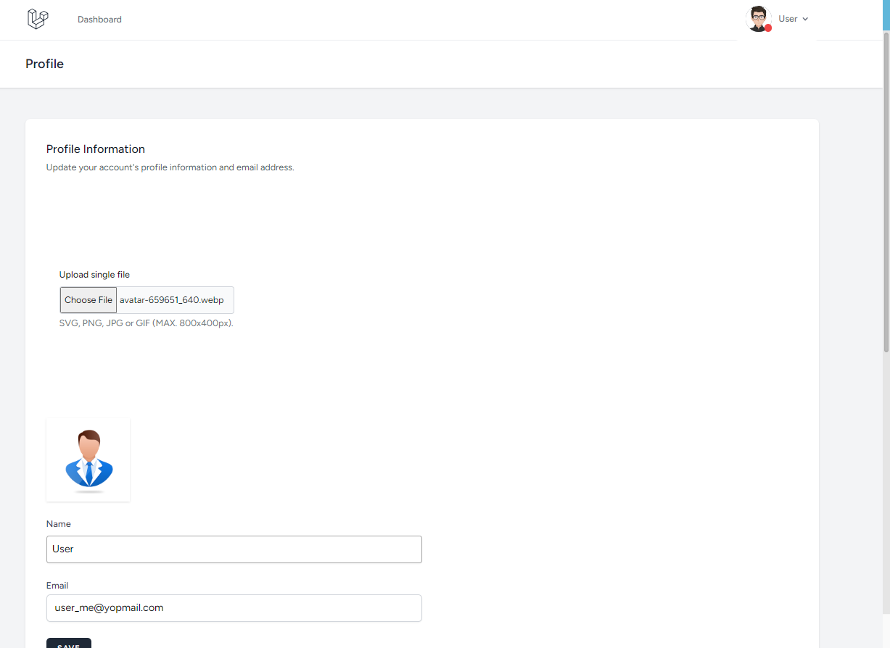

## Dashboard Screen

## Chat Screen Screen

## Profile Screen

## Steps to Run Project
- Clone Project Using Command  
    - git clone https://github.com/SarDevelops/LaravelReverbChatApp.git

## Commands 
- Composer Update
- php artisan key:generate
- php artisan migrate --seed
- npm install
- npm run dev

## Credentials
- Admin
    - user : admin_me@yopmail.com
    - password : password
- User
    - user : user_me@yopmail.com
    - password : password
- test
    - user : test_me@yopmail.com
    - password : password

## Note
- Before run migration command please make database.sqlite file in database folder

